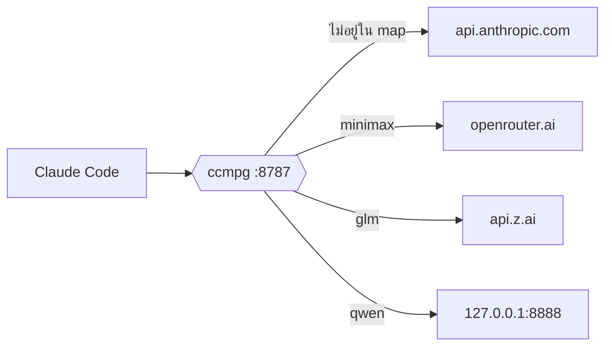

# ccmpg — Claude Code Multi-Provider Gateway

> พร็อกซีเล็ก ๆ ที่ให้ Claude Code ใช้โมเดลจากหลายผู้ให้บริการได้ใน session เดียว
> โมเดลของ Anthropic วิ่งตรงเข้า `api.anthropic.com` ตามปกติ ส่วนโมเดลอื่นวิ่งไปตามที่ตั้งไว้ใน `.ccmpg.yaml`

<p align="center">
  
  
  
</p>

---

## ทำไมต้องมี

Claude Code ตั้ง `ANTHROPIC_BASE_URL` ได้ **ที่เดียว** ต่อ 1 session จึงทำสิ่งเหล่านี้ไม่ได้:

- ใช้ Subscription Plan กับโมเดลนอกพร้อมกัน
- ให้ subagent ใช้โมเดลที่ถูกกว่า main agent
- สลับไปโมเดล local ชั่วคราวโดยไม่ต้องแก้ env แล้วรีสตาร์ต

ccmpg ยืนคั่นกลางเป็น endpoint เดียว แล้วดูฟิลด์ `model` ของแต่ละ request ว่าจะส่งต่อไปที่ไหน



**กฎมีข้อเดียว** — ชื่อโมเดลอยู่ใน `models:` ก็ส่งไปหา provider นั้น ถ้าไม่อยู่ก็ส่งไป `api.anthropic.com`
พร้อม header เดิมทั้งชุด ทำให้ Subscription Plan ยังทำงานได้โดยที่ ccmpg ไม่ต้องรู้จัก credential ของคุณ

---

## เริ่มใช้งาน

**1 · ติดตั้ง**

```bash
npm install -g ccmpg
ccmpg
# or
npx ccmpg
```

หรือใช้โดยไม่ติดตั้ง — เติม `npx` นำหน้าทุกคำสั่ง เช่น `npx ccmpg init`, `npx ccmpg start -d`

**2 · สร้างไฟล์ตั้งค่าในโปรเจกต์**

```bash
cd my-project
ccmpg init
```

สร้าง `./.ccmpg.yaml` แล้วถามว่าจะให้ชี้ Claude Code มาที่ Gateway เลยไหม:

```
? Point Claude Code at the gateway for this project?  .claude/settings.local.json (Y/n)
```

ตอบ `Y` จะได้ `./.claude/settings.local.json` ที่มี `ANTHROPIC_BASE_URL` ให้ (ข้ามคำถามด้วย `-y`
หรือปฏิเสธไปเลยด้วย `--no-settings`)

จากนั้น `.gitignore` จะถูกสร้างหรือต่อท้ายให้อัตโนมัติ เพิ่ม `.ccmpg.yaml` และ
`.claude/settings.local.json` เข้าไป — สองไฟล์นี้เป็นของเครื่องคุณคนเดียวและอาจมีคีย์จริงอยู่
(ไม่ต้องการก็ใช้ `--no-gitignore`) กฎเดิมในไฟล์ไม่ถูกแตะ และรันซ้ำก็ไม่เพิ่มบรรทัดซ้ำ

จากนั้นเปิด `.ccmpg.yaml` มาแก้:

```yaml
version: 1

server:
  host: 127.0.0.1
  port: 8787

providers:
  openrouter:
    base_url: https://openrouter.ai/api
    api_key: sk-or-v1-xxxxxxxxxxxxxxxx   # วางคีย์ลงตรงนี้ได้เลย

models:
  minimax:                               # ชื่อที่จะพิมพ์ใน /model
    model: minimax-m3:free               # ชื่อโมเดลจริงฝั่ง provider
    provider: openrouter
```

คีย์ OpenRouter ขอได้ที่ [openrouter.ai/keys](https://openrouter.ai/keys)
โมเดลของ Anthropic ไม่ต้องประกาศ เพราะทุกอย่างที่ไม่อยู่ใน `models:` วิ่งตรงอยู่แล้ว

**3 · เปิด Gateway**

```bash
ccmpg
```

```
ccmpg 1.0.0  ·  listening on http://127.0.0.1:8787
  config     ./.ccmpg.yaml
  providers  openrouter
  models     minimax
  default    api.anthropic.com

  Ctrl+C เพื่อหยุด  ·  ccmpg start -d เพื่อรันเบื้องหลัง
```

**4 · เปิด terminal ใหม่แล้วรัน Claude Code**

```bash
claude
```

ถ้าตอบ `Y` ตอน `ccmpg init` ไปแล้ว `ANTHROPIC_BASE_URL` อยู่ใน `.claude/settings.local.json` เรียบร้อย ไม่ต้องตั้ง env เอง
(ระดับ global ใช้ `ccmpg init -g` ซึ่งเขียนลง `~/.claude/settings.json` แทน)

**5 · สลับโมเดลระหว่างใช้งาน**

```
/model minimax      ← alias จาก .ccmpg.yaml
/model sonnet       ← กลับไปใช้ Anthropic
```

---

## การตั้งค่า

ไฟล์ชื่อ `.ccmpg.yaml` เสมอ วางได้ 2 ที่:

| ระดับ | ตำแหน่ง | ธง |
| --- | --- | --- |
| project | `./.ccmpg.yaml` | (ค่าเริ่มต้น) |
| global | `~/.config/ccmpg/.ccmpg.yaml` | `-g` |

ถ้ามีทั้งคู่ ccmpg จะอ่าน global เป็นฐานแล้วเอา project ทับทีละคีย์ — เก็บ provider กับคีย์ไว้ที่ global
แล้วให้แต่ละโปรเจกต์ประกาศเฉพาะ model alias ที่ต้องใช้ ตรวจผลรวมด้วย `ccmpg config`

### คีย์ทั้งหมด

```yaml
server:
  host: 127.0.0.1        # ดีฟอลต์ — อย่าเปลี่ยนเป็น 0.0.0.0 เพราะไม่มีระบบยืนยันตัวตน
  port: 8787

providers:
  <provider>:
    base_url: ...        # จำเป็น — ไม่ต้องมี /v1 ต่อท้าย
    api_key: ...         # ใส่คีย์ตรง ๆ หรือ ${ENV_VAR} ก็ได้

models:
  <alias>:
    model: ...           # ชื่อโมเดลจริงที่จะเขียนทับลง request
    provider: ...        # ต้องตรงกับชื่อใน providers:
```

> ใส่คีย์จริงลงไฟล์ได้ถ้าใช้คนเดียว แต่ต้อง `.gitignore` ก่อน commit
> ถ้าจะแชร์กับทีม เปลี่ยนเป็น `${OPENROUTER_API_KEY}` แล้วให้แต่ละคนตั้ง env เอง

---

## ให้ subagent ใช้คนละโมเดล

นี่คือสิ่งที่ทำไม่ได้ถ้าไม่มี Gateway — ใส่ alias ลง frontmatter ของ agent:

```markdown
---
name: researcher
description: ค้นหาและสรุปข้อมูลจากโค้ดเบส
model: minimax
---

ตอบสั้น กระชับ อ้างอิง path ไฟล์เสมอ
```

main agent ยังใช้ Opus ผ่าน Subscription ตามปกติ ส่วน `researcher` วิ่งผ่าน OpenRouter — ใน session เดียวกัน

---

## คำสั่ง

ทุกคำสั่งรับ `-g` เพื่อทำงานกับคอนฟิกระดับ global

| คำสั่ง | ทำอะไร |
| --- | --- |
| `ccmpg` · `ccmpg start` | เปิด Gateway เห็น log สด ปิดด้วย `Ctrl+C` |
| `ccmpg start -d` | เปิดเบื้องหลัง |
| `ccmpg stop` · `restart` · `status` | ปิด · เปิดใหม่พร้อมโหลดคอนฟิก · ดูสถานะ |
| `ccmpg logs -f` | ตามดู log ของตัวที่รันเบื้องหลัง |
| `ccmpg startup` | ให้เปิดเองตอนบูต — launchd / systemd user unit / Startup folder ตาม OS (ยกเลิกด้วย `unstartup`) |
| `ccmpg init` · `config` | สร้าง `.ccmpg.yaml` + settings ของ Claude Code · ดูคอนฟิกหลังรวมแล้ว |
| `ccmpg provider add` · `rm` · `ls` | จัดการ provider |
| `ccmpg model add` · `rm` · `ls` | จัดการ model alias |

`add` และ `rm` ใช้ได้ 2 แบบ — พิมพ์เปล่า ๆ แล้วให้ถามทีละข้อ หรือใส่ค่าครบในบรรทัดเดียวสำหรับสคริปต์:

```console
$ ccmpg model add

? ชื่อ alias .......... glm
? model id ........... glm-4.6
? ใช้ provider ไหน
  ❯ openrouter   https://openrouter.ai/api
    z_ai         https://api.z.ai/api/anthropic
```

```bash
ccmpg provider add z_ai --base-url https://api.z.ai/api/anthropic --api-key sk-...
ccmpg model add glm --model glm-4.6 --provider z_ai
ccmpg model rm glm -y
```

คำสั่งกลุ่มนี้แก้ YAML โดยรักษาคอมเมนต์เดิม และตรวจก่อนเขียนเสมอ — `model add` ปฏิเสธถ้า provider ไม่มีอยู่
`provider rm` ปฏิเสธถ้ายังมี alias อ้างถึง เมื่อไม่ได้รันบน terminal จริงจะไม่ถาม แต่ฟ้องว่าขาด flag ตัวไหน

### Flag ทั้งหมด

| Flag | ใช้กับ | ทำอะไร |
| --- | --- | --- |
| `-g`, `--global` | ทุกคำสั่ง | ทำงานกับ `~/.config/ccmpg/.ccmpg.yaml` |
| `-d`, `--detach` | `start` | รันเบื้องหลัง |
| `-p`, `--port <number>` | `start`, `startup`, `init` | override `server.port` (1–65535) |
| `--host <addr>` | `start`, `startup` | override `server.host` |
| `--dump [file]` | `start` | บันทึกทุก request/response (ค่าเริ่มต้น `dump.log`) |
| `-v`, `--verbose` | `start` | พิมพ์ header ที่ส่งออกและ URL ปลายทาง |
| `-f`, `--follow` | `logs` | ตามดูต่อเนื่อง |
| `-a`, `--all` | `status` | แสดง gateway ที่รันอยู่ทุกตัว ไม่ใช่แค่ scope ปัจจุบัน |
| `-y`, `--yes` | `provider rm`, `model rm`, `init` | ตอบ yes ให้คำถามยืนยัน |
| `--force` | `init` | เขียนทับ `.ccmpg.yaml` ที่มีอยู่แล้ว |
| `--cascade` | `provider rm` | ลบ model alias ที่อ้างถึง provider นั้นไปด้วย |
| `--no-settings` | `init` | ไม่ต้องแก้ settings ของ Claude Code |
| `--no-gitignore` | `init` | ไม่ต้องแก้ `.gitignore` |
| `--base-url`, `--api-key` | `provider add` | ใส่ค่าแทนการถามทีละข้อ |
| `--model`, `--provider` | `model add` | ใส่ค่าแทนการถามทีละข้อ |
| `--version`, `-h`/`--help` | — | เวอร์ชัน · วิธีใช้ |

> **`--dump` เก็บ body ของทุก request และ response ลงไฟล์** — API key ถูก mask แล้ว
> แต่เนื้อหาบทสนทนาไม่ได้ถูกปิด ให้ถือว่าไฟล์นี้เป็นข้อมูลอ่อนไหว `ccmpg init`
> เพิ่ม `dump.log` ให้ใน `.gitignore` อยู่แล้ว

### แจ้งเตือนเวอร์ชันใหม่

เมื่อมีเวอร์ชันใหม่บน npm ccmpg จะขึ้นข้อความแบบเดียวกับ npm:

```
Update available 1.1.0 -> 1.1.2
Run npm i -g ccmpg to update
```

ข้อความอ่านจากแคชที่รีเฟรชเบื้องหลังวันละครั้ง — ไม่มีคำสั่งไหนต้องรอเน็ต และออกทาง stderr
จึงไม่ปนกับ output เวลา pipe ปิดด้วย `CCMPG_NO_UPDATE_CHECK=1`

---

## Log

สองบรรทัดต่อหนึ่ง request:

```
09:14:22 >>> openrouter | minimax | /v1/messages
09:14:31 <<< openrouter | minimax | in=18432 out=612 cache_hit=17920 stop=end_turn
```

สถิติอ่านจาก SSE ระหว่างที่ stream ไหลผ่าน ไม่มีการ buffer ทั้งก้อน
เจอปัญหาให้เปิด `--dump` แล้วดู `dump.log` ซึ่งเก็บ header และ body ดิบทั้งขาไปขากลับ

| อาการ | วิธีแก้ |
| --- | --- |
| `400 model not found` | ตรวจว่า `models.<alias>.model` ตรงกับชื่อจริงฝั่ง provider |
| แก้ `.ccmpg.yaml` แล้วไม่มีผล | `ccmpg restart` |
| `/model x` ยังวิ่งไป Anthropic | `ccmpg status` ดูว่าโหลดคอนฟิกไฟล์ไหน |

---

## ข้อจำกัด

- รองรับเฉพาะรูปแบบ **Anthropic Messages** — provider ที่เป็น OpenAI-compatible ต้องมีตัวแปลงคั่นหน้า
- ออกแบบมาสำหรับ **streaming** เป็นหลัก non-streaming ส่งผ่านได้แต่ไม่เก็บสถิติ
- **ไม่มีระบบยืนยันตัวตน** — อย่า bind `0.0.0.0` บนเครือข่ายสาธารณะ
- ไม่มี retry หรือ failover เมื่อ provider ล่ม
- ไม่แปลง body ระหว่างรูปแบบ (tool schema, image block ต้องเข้ากันได้อยู่แล้ว)

สิ่งที่ **รองรับแล้ว** และเทสต์คุมไว้: ทุก endpoint ทุกเมธอด query string body ขนาดใหญ่
สถานะ error พร้อม header `retry-after` / `anthropic-ratelimit-*` และ **WebSocket** (`Upgrade`)
ซึ่งถูก tunnel เป็น raw socket ไม่ผ่าน `fetch`

### `/remote-control` ใช้ไม่ได้ระหว่างเปิด Gateway

`/remote-control` จะขึ้น **Remote Control initialization failed** เมื่อ `ANTHROPIC_BASE_URL`
ไม่ได้ชี้ไปที่ `api.anthropic.com`

นี่เป็นข้อกำหนดของ Claude Code เอง **ไม่ใช่บั๊กของ ccmpg และพร็อกซีแก้ไม่ได้** — Claude Code
อ่านค่า env นี้แล้วปฏิเสธตั้งแต่ต้น ก่อนจะยิง request ออกมาถึง Gateway ด้วยซ้ำ ข้อความในตัวโปรแกรมระบุว่า:

> `ANTHROPIC_BASE_URL` is set and does not point at `api.anthropic.com`, so this session is
> using a custom endpoint

แม้แต่ `_CLAUDE_CODE_ASSUME_FIRST_PARTY_BASE_URL` ก็ข้ามไม่ได้ เพราะ Claude Code ยกเว้น
Remote Control ไว้เป็นกรณีพิเศษ ข้อจำกัดนี้เกิดกับพร็อกซีทุกตัวเหมือนกันหมด ไม่ใช่เฉพาะ ccmpg
และฟีเจอร์อื่นที่ต้องต่อตรงกับ Anthropic ก็อาจโดนตรวจแบบเดียวกัน (เช่น `/feedback`)

**วิธีเลี่ยง** — ใช้ Remote Control ใน session ที่ไม่มี `ANTHROPIC_BASE_URL`:

```bash
# เอาบรรทัด ANTHROPIC_BASE_URL ออกจาก .claude/settings.local.json ชั่วคราว แล้วเปิด claude ใหม่
# หรือรัน claude จากโฟลเดอร์อื่นที่ไม่มีไฟล์ตั้งค่านั้น
```

ถ้าตั้งไว้ระดับ global (`ccmpg init -g`) จะกระทบทุกโปรเจกต์ — ใช้ระดับโปรเจกต์แทนจะคุมได้ง่ายกว่า

สิ่งที่ ccmpg จัดการให้เงียบ ๆ: ตัด header hop-by-hop, บังคับ `accept-encoding: identity` เพื่อให้อ่าน SSE ได้,
ตัด suffix `[1m]` และ `anthropic-beta: oauth-2025-04-20` ก่อนส่งไปหา provider อื่น

---

## โครงสร้างโปรเจกต์

```
ccmpg/
├── bin/ccmpg.js            # parse args แล้ว dispatch
├── src/
│   ├── commands/
│   │   ├── init.js         # เขียน .ccmpg.yaml เริ่มต้น
│   │   ├── start.js        # foreground และ spawn แบบ -d
│   │   ├── lifecycle.js    # stop · restart · status · logs
│   │   ├── provider.js     # add · rm · ls
│   │   ├── model.js        # add · rm · ls
│   │   ├── show.js         # ccmpg config
│   │   ├── startup.js      # ลงทะเบียนให้เปิดตอนบูต
│   │   └── shared.js       # ตารางและการมาสก์คีย์
│   ├── config.js           # โหลดและรวม global + project, แทนค่า ${ENV}, validate
│   ├── claude-settings.js  # merge ANTHROPIC_BASE_URL ลง settings ของ Claude Code
│   ├── gitignore.js        # ต่อท้าย .gitignore แบบไม่ซ้ำและไม่แตะกฎเดิม
│   ├── update.js           # แจ้งเตือนเวอร์ชันใหม่จากแคช รีเฟรชเบื้องหลัง
│   ├── router.js           # เลือก provider และเขียนทับ body.model — ฟังก์ชันบริสุทธิ์
│   ├── headers.js          # กรอง hop-by-hop, ใส่ auth, ตัด oauth beta — ฟังก์ชันบริสุทธิ์
│   ├── usage.js            # แกะ SSE เก็บ token usage แบบ streaming
│   ├── server.js           # HTTP server + catch-all route
│   ├── daemon.js           # pid file และ registry ของ instance ที่รันอยู่
│   ├── edit.js             # แก้ YAML แบบ atomic รักษาคอมเมนต์
│   ├── prompt.js           # ถามทีละข้อ ปิดตัวเองเมื่อไม่ใช่ TTY
│   └── log.js              # จัดรูป log และ --dump
├── test/                   # node --test
└── .ccmpg.yaml
```

`ccmpg start -d` เก็บ pid และ log ไว้ที่ `~/.local/state/ccmpg/` เป็น runtime state ลบทิ้งได้เมื่อไม่มีอะไรรันอยู่

```bash
git clone https://github.com/themaxaboy/claude-code-multi-provider-gateway.git && cd claude-code-multi-provider-gateway
npm install
node bin/ccmpg.js init    # สร้าง .ccmpg.yaml ก่อน แล้วแก้ให้ตรงกับ provider ของคุณ
npm run dev
```

| สคริปต์ | ทำอะไร |
| --- | --- |
| `npm run dev` | เปิด Gateway แบบ verbose และรีสตาร์ตเองเมื่อแก้ไฟล์ใน `src/` |
| `npm start` | เปิดแบบปกติ ไม่มี watch |
| `npm test` · `npm run test:watch` | รันเทสต์ · รันใหม่ทุกครั้งที่แก้ไฟล์ |
| `npm run install:global` | ติดตั้ง `ccmpg` ระดับ global จากซอร์สในโฟลเดอร์นี้ |
| `npm run uninstall:global` | ถอนออก |
| `npm run link` · `npm run unlink` | symlink ระดับ global — แก้โค้ดแล้วมีผลทันที ไม่ต้องติดตั้งใหม่ |

> ชื่อสคริปต์คือ `install:global` ไม่ใช่ `install` เพราะ **`install` เป็น lifecycle hook ของ npm**
> ถ้าตั้งชื่อว่า `install` มันจะยิงเองทุกครั้งที่รัน `npm install` ธรรมดา
>
> ระหว่างพัฒนาให้ใช้ `npm run link` จะดีกว่า เพราะแก้โค้ดแล้วเห็นผลทันทีโดยไม่ต้องติดตั้งซ้ำ

---

## เครดิต

ได้แรงบันดาลใจจาก [white-hat/claude-code-proxy](https://github.com/white-hat/claude-code-proxy)

## License

MIT
